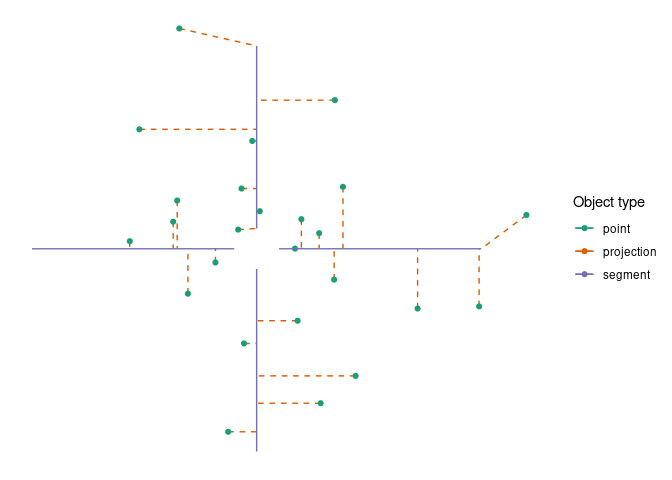
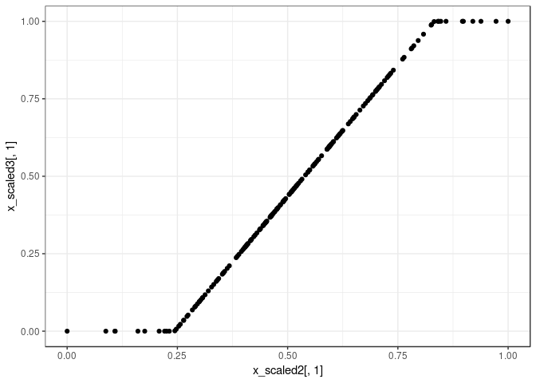

Overview of the functionality provided by the dynutils package
================
Robrecht Cannoodt & Wouter Saelens

<!-- github markdown using
rmarkdown::render("vignettes/functionality.Rmd", output_format = "github_document")
-->
Table of contents
-----------------

-   Manipulation of lists: [`add_class`](functionality.md#add_class-add-a-class-to-an-object), [`extend_with`](functionality.md#extend_with-extend-list-with-more-data)
-   Calculations: [`calculate_distance`](functionality.md#calculate_distance-compute-pairwise-distances-between-two-matrices), [`project_to_segments`](functionality.md#project_to_segments-project-a-set-of-points-to-to-set-of-segments)
-   Manipulation of matrices: [`expand_matrix`](functionality.md#expand_matrix-add-rows-and-columns-to-a-matrix)
-   Scaling of matrices and vectors: [`scale_uniform`](functionality.md#scale_uniform-rescale-data-to-have-a-certain-center-and-max-range), [`scale_minmax`](functionality.md#scale_minmax-rescale-data-to-a---range), [`scale_quantile`](functionality.md#scale_quantile-cut-off-outer-quantiles-and-rescale-to-a---range)
-   Manipulation of functions: [`inherit_default_params`](functionality.md#inherit_default_params-have-one-function-inherit-the-default-parameters-from-other-functions)
-   Manipulation of packages: [`check_packages`](functionality.md#check_packages-easily-checking-whether-certain-packages-are-installed), [`install_packages`](functionality.md#install_packages-install-packages-taking-into-account-the-remotes-of-another)
-   Manipulation of character vectors: [`pritt`](functionality.md#pritt-a-friendly-version-of-glueglue), [`random_time_string`](functionality.md#random_time_string-generates-a-string-very-likely-to-be-unique)
-   Tibble helpers: [`list_as_tibble`](functionality.md#list_as_tibble-convert-a-list-of-lists-to-a-tibble-whilst-retaining-class-information), [`tibble_as_list`](functionality.md#tibble_as_list-convert-a-tibble-back-to-a-list-of-lists-whilst-retaining-class-information), [`extract_row_to_list`](functionality.md#extract_row_to_list-extracts-one-row-from-a-tibble-and-converts-it-to-a-list), [`mapdf`](functionality.md#mapdf-apply-a-function-to-each-row-of-a-data-frame)

Manipulation of lists
---------------------

### `add_class`: Add a class to an object

    #> $important_number
    #> [1] 42
    #> 
    #> attr(,"class")
    #> [1] "my_list" "list"

### `extend_with`: Extend list with more data

    #> $important_number
    #> [1] 42
    #> 
    #> $url
    #> [1] "https://github.com/dynverse/dynverse"
    #> 
    #> attr(,"class")
    #> [1] "improved_list" "my_list"       "list"

Calculations
------------

### `calculate_distance`: Compute pairwise distances between two matrices

See `?calculate_distance` for the list of currently supported distances.

    #>          [,1]      [,2]      [,3]     [,4]      [,5]
    #> [1,] 1.184305 0.9571034 1.1284052 1.022205 1.5531565
    #> [2,] 1.078353 1.1378581 0.7076092 1.072164 0.8846294
    #> [3,] 1.335627 1.4116406 1.3526085 1.239853 1.6282805

For euclidean distances, this is similar to calculating:

    #>          4         5         6        7         8
    #> 1 1.184305 0.9571034 1.1284052 1.022205 1.5531565
    #> 2 1.078353 1.1378581 0.7076092 1.072164 0.8846294
    #> 3 1.335627 1.4116406 1.3526085 1.239853 1.6282805

### `project_to_segments`: Project a set of points to to set of segments

    #> List of 4
    #>  $ x_proj     : num [1:25, 1:2] 0 0 0 0.278 0 ...
    #>  $ distance   : num [1:25] 0.0068 0.01605 0.12144 0.00587 0.12604 ...
    #>  $ segment    : int [1:25] 1 2 1 3 1 4 2 3 2 2 ...
    #>  $ progression: num [1:25] 1 0.108 0.297 0.802 0 ...

Manipulation of matrices
------------------------

### `expand_matrix`: Add rows and columns to a matrix

    #>   A B C         D E         F G         H         I J
    #> a 0 0 0 0.2937302 0 0.5033395 0 0.7581031 0.5476466 0
    #> b 0 0 0 0.0000000 0 0.0000000 0 0.0000000 0.0000000 0
    #> c 0 0 0 0.1912601 0 0.8770575 0 0.7244989 0.7117439 0
    #> d 0 0 0 0.8864509 0 0.1891936 0 0.9437248 0.3889051 0
    #> e 0 0 0 0.0000000 0 0.0000000 0 0.0000000 0.0000000 0

Scaling of matrices and vectors
-------------------------------

### `scale_uniform`: Rescale data to have a certain center and max range

Generate a matrix from a normal distribution with a large standard deviation, centered at c(5, 5).

Center the dataset at c(0, 0) with a minimum of c(-.5, -.5) and a maximum of c(.5, .5).

Check the ranges and verify that the scaling is correct.

    #>            [,1] [,2]
    #> [1,] -0.4061179 -0.5
    #> [2,]  0.4061179  0.5
    #> [1] 0 0
    #> [1] 0.8122358 1.0000000

### `scale_minmax`: Rescale data to a \[0, 1\] range

Check the ranges and verify that the scaling is correct.

    #>      [,1] [,2]
    #> [1,]    0    0
    #> [2,]    1    1

### `scale_quantile`: Cut off outer quantiles and rescale to a \[0, 1\] range

Check the ranges and verify that the scaling is correct.

    #>      [,1] [,2]
    #> [1,]    0    0
    #> [2,]    1    1

Manipulation of functions
-------------------------

### `inherit_default_params`: Have one function inherit the default parameters from other functions

    #> function (a = 10, b = 7, c = 9) 
    #> {
    #>     list(x = fun1(a, b), y = fun2(c))
    #> }

Manipulation of packages
------------------------

### `check_packages`: Easily checking whether certain packages are installed

    #>         SCORPIUS         dynutils wubbalubbadubdub 
    #>             TRUE             TRUE            FALSE
    #> princurve       mlr tidyverse 
    #>      TRUE      TRUE      TRUE

### `install_packages`: Install packages taking into account the remotes of another

This is useful for installing suggested packages with GitHub remotes.

    > install_packages("SCORPIUS", package = "dynmethods", prompt = TRUE)
    Following packages have to be installed: SCORPIUS
    Do you want to install these packages? (y/yes/1 or n/no/2): 1
    Installing SCORPIUS
    ...
    ** testing if installed package can be loaded
    * DONE (SCORPIUS)
    Installed SCORPIUS
    [1] "SCORPIUS"

Manipulation of character vectors
---------------------------------

### `pritt`: A friendly version of `glue::glue`

    #> [1] "a: 10"
    #> a: 10
    #> [1] "glue"      "character"

### `random_time_string`: Generates a string very likely to be unique

    #> [1] "20180718_112029__test__mMIwnRLQgq"
    #> [1] "20180718_112029__test__X7HCfj0o6f"
    #> [1] "20180718_112029__test__F9Y32SIQAy"

Tibble helpers
--------------

### `list_as_tibble`: Convert a list of lists to a tibble whilst retaining class information

    #> # A tibble: 2 x 4
    #>       a b         c      .object_class
    #>   <dbl> <list>    <chr>  <list>       
    #> 1     1 <builtin> parrot <chr [2]>    
    #> 2     2 <builtin> quest  <chr [2]>

### `tibble_as_list`: Convert a tibble back to a list of lists whilst retaining class information

    #> [[1]]
    #> $a
    #> [1] 1
    #> 
    #> $b
    #> function (x)  .Primitive("log10")
    #> 
    #> $c
    #> [1] "parrot"
    #> 
    #> attr(,"class")
    #> [1] "myobject" "list"    
    #> 
    #> [[2]]
    #> $a
    #> [1] 2
    #> 
    #> $b
    #> function (x)  .Primitive("sqrt")
    #> 
    #> $c
    #> [1] "quest"
    #> 
    #> attr(,"class")
    #> [1] "yourobject" "list"

### `extract_row_to_list`: Extracts one row from a tibble and converts it to a list

    #> $a
    #> [1] 2
    #> 
    #> $b
    #> function (x)  .Primitive("sqrt")
    #> 
    #> $c
    #> [1] "quest"
    #> 
    #> attr(,"class")
    #> [1] "yourobject" "list"

### `mapdf`: Apply a function to each row of a data frame

The `mapdf` functions apply a function on each row of a data frame. They are based heavily on purrr's `map` functions.

    #> [[1]]
    #> [1] "myobject" "list"    
    #> 
    #> [[2]]
    #> [1] "yourobject" "list"

Or use an anonymous function.

    #> [[1]]
    #> [1] "0_parrot"
    #> 
    #> [[2]]
    #> [1] "1.4142135623731_quest"

Or even a formula.

    #> [[1]]
    #> function (x)  .Primitive("log10")
    #> 
    #> [[2]]
    #> function (x)  .Primitive("sqrt")

There are many more variations available. See `?mapdf` for more info.

    #> [1] FALSE  TRUE
    #> [1] "~parrot~" "~quest~"
    #> [1] 6 5
    #> [1] 1.234 2.468
